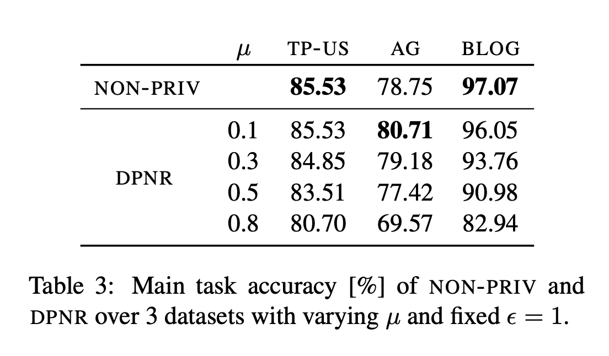

### 2024/Nov/20
## DP Representation for NLP

Today we read the paper [*DP Representation for NLP: Formal Guarantee and An Empirical Study on Privacy and Fairness*](https://aclanthology.org/2020.findings-emnlp.213.pdf). This paper was accepted in ACL 2020, a flagship conference in NLP. I am not an expert in fairness, so I will focus on the privacy side.

The authors consider this problem. Given a data point $x$, how to make its representation (its extracted features) in an NLP model private? The motivation is to defend against attackers who have access to the feature extraction layers. It can also be extended to the federated learning setting, where the local user devices could extract the user's features in a DP manner, and then send the DP representations to a server to get predictions. See the nice Figures 1 and 2 provided by the authors below.


This idea sounds familiar to local DP, where each user perturbs her/his local data before sharing it with others. Indeed, the authors write ```For scenarios
where data are sourced from end users, and end users do not trust any third parties, DP should be enforced in a “local” manner to enable end users to perturb their data before publication, which is termed as LDP (Dwork and Roth, 2014; Duchi
et al., 2013). Compared with CDP, LDP offers a stronger level of protection. In our system, we aim to protect the test-phase privacy of the extracted neural representations from end users, we therefore adopt LDP...```

(Tip: I recommend to cite local DP properly; [*What can we learn privately?*](https://ieeexplore.ieee.org/document/4690986) is the reference, instead of the textbook by Dwork and Roth, 2014.) 

How did the authors enforce LDP? They follow the approach in [*Privacy-preserving deep learning*](https://dl.acm.org/doi/10.1145/2810103.2813687), and inject independent laplace noise into each dimension of the feature layer. How much DP does the laplace noise provide? Theorem 3.6 from the DP textbook tells us that the privacy level can be computed from the sensitivity of the information to release and the scale of the laplace noise. 


In this paper, the information to release is the features of the input data, the sensitivity of which is difficult to compute (a neural network is almost a black box). The authors proceed to clip the value in each dimension of the feature vector to the range $[0,1]$, a standard operation to enforce DP, and ```hence bounding the
sensitivity of each element of the extracted representation with 1, i.e.,``` $\Delta f=1$, and apply the laplace mechanism as follows.


This theorem is incorrect. Because when there are $d$ dimensions in the extracted representation, the sensitivity $\Delta f$ should be $d$ instead of $1$. No wonder the authors obtain surprisingly good results on their local DP approaches.

 

In the above table, the accuracy barely changes after Local DP is enforced, because the reported $\epsilon$ is on per dimension. The true privacy guarantee ($\epsilon$) should be $d$ times the per-dimensional guarantee, which can be millions or billions for NLP models (which means almost no privacy at all). Similarly, the results obtained from [*Privacy-preserving deep learning*](https://dl.acm.org/doi/10.1145/2810103.2813687) is also incorrect, as they only quantified the per-dimension privacy guarantees. This issue was also mentioned in [Frank's blog](https://github.com/frankmcsherry/blog/blob/master/posts/2017-10-27.md) in 2017. Maybe the reviewers were just so careless that they did not perform any sanity check on the results, propagating this error from 2015 to 2020, and later papers as well (see the below figure from a recent follow-up work). Surprise, Frank! The reviewers did not read your blog.

 

How to spot such mistakes? 

I believe that it is impossible to go through every detail in the proof of every paper. Still, we should build some intuition about differential privacy (especially for researchers publishing papers, it is better not to circulate incorrect ideas). 

In this paper, the main (but wrong) meassage is that with local DP enforced, the prediction accuracy barely changes. This is obviously incorrect. The intuition is simple: local DP effectively obfuscates all information about an individual ('s features) so that no downstream task recover it (DP is preserved under post-processing) and produce accurate personal-level prediction. On the other hand, if the task is to learn something about a population (rather than an individual), then local DP still works. Because when individual's contribution (obfuscated or not) may not influence the trend of a population.

I hope my post helps you to build some intuition on differential privacy.


