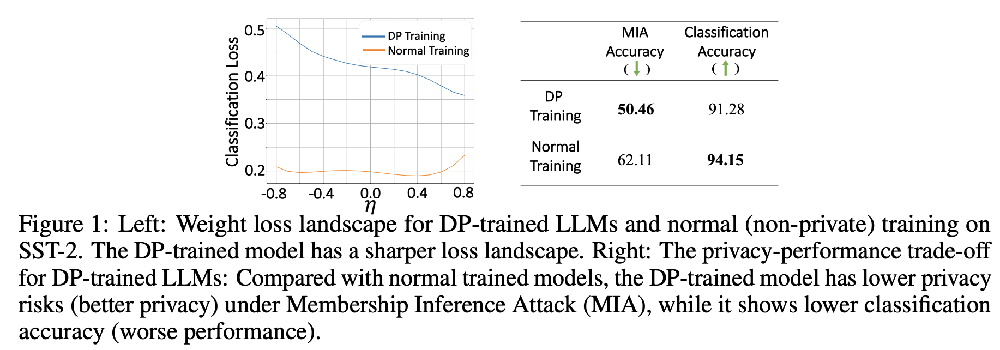

### 2024/Nov/19
## Differential Privacy through Flatness. 

I came across this paper called [*Privacy-preserving Fine-tuning of Large Language Models through Flatness*](https://openreview.net/forum?id=LtdcfCw92l&referrer=%5Bthe%20profile%20of%20Tianlong%20Chen%5D(%2Fprofile%3Fid%3D~Tianlong_Chen1)). This paper is accepted to SeT LLM @ ICLR 2024. So if you are reading my reviews, then perhaps you know ICLR. But you may not know SeT LLM. You can compare SeT LLM to ICLR to a franchise to a larger brand, much like Volkswagen is to the Volkswagen Group (which also includes Porsche and Audi). While Volkswagen doesn’t represent the highest standard of the brand, it’s still part of the lineup, so please join me and give it a try. 

In the abstract, the authors write that ***our paper reveals that the flatness of DP-trained models' loss landscape plays an essential role in the trade-off between their privacy and generalization.*** They show that when you perturb the model parameters $w$ with some random noise $d$ sampled from a standard Gaussian distribution times some magnitude $\eta$. Then the loss computed on 

$$w+\eta d$$

is less stable as we increase $\eta$, if $w$ is a DP model, compared with a non-DP model. This makes sense to me--DP models are less flat--at least this is confirmed from Figure 1 below. So maybe we can do something about the sharpness to make DP models perform better.




The authors then propose ```a holistic framework to enforce appropriate weight flatness, which substantially improves model generalization with competitive privacy preservation```. Their algorithm is based on the following non-DP prototype. In each iteration with model weight $w$,

1. find $v$ such that the loss is *maximized* at $w+v$;
2. compute the model's gradient at $w+v$, and then perform the gradient descent from $w$.

How to make this algorithm differentially private? Allow me to review the definition of DP. 

***We say a mechanism is DP if the following holds (roughly) the output of this mechanism does not depend much on any particular record in its input.*** DP is often enforced by perturbing the outcome of the mechanism, and the scale of the perturbation is proportional to the maximum influence that could be caused by any individual record. As a result, individual-level privacy is perserved and the information about the population/dataset is not completely hidden.

How did the authors make this algorithm DP? The authors wrote ```We tailor AWP to DP training with two critical changes...the required noises in DP training are only added to the final gradient...instead of the process of computing v (in the first step)```. I gave up reading after seeing this. The first step is not perturbed with noises, so the overall algorithm is not differentially private. Because the information of training data is already encoded in $w+v$, so it could happen that the gradients computed in the second are all based on some particular record. In this case, adding DP noises to obfuscate one gradient does not help hide this information at all. 

This concludes my first review. Maybe the authors have made some pioneering efforts ```to investigate that the critical role of weight flatness in DP-trained LLMs```. Sadly I do not understand those efforts. This is similar to seeing cold chocolates on top of hot pizzas with melting cheese. It is a quite bold combination but I could not appreciate the idea; perhaps, if the chef really cares about pizza, at least, please, make the chocolates hot. 
